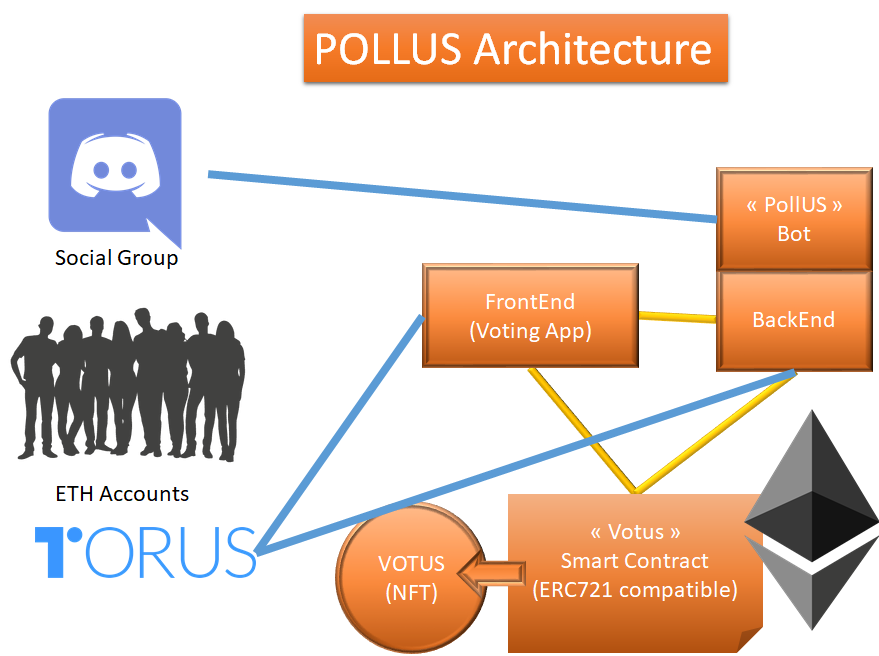
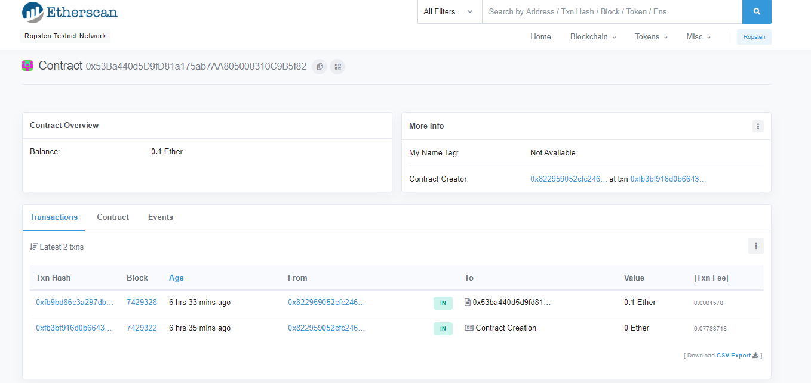
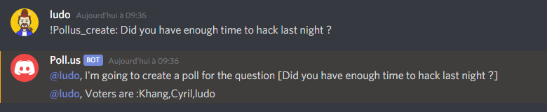
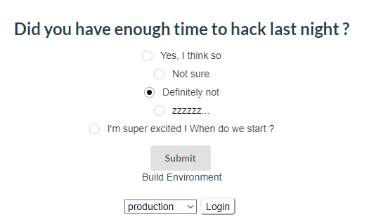

# POLL.US
## Trustless Polling App for Social Groups on Social Networks


### Architecture



### Smart Contract
deployed on Ropsten at 0x53Ba440d5D9fD81a175ab7AA805008310C9B5f82


### Illustrations

On Discord group, invoking the Poll.Us Bot:


On Voting app, just a few moment later, after login with Torus


### Get Started

#### Votus (Smart Contract)

##### Build

```console
cd token
truffle compile
```

##### Deploy

###### Local (Ganache)

Configure Ganache to serve at http://127.0.0.1:8545, with network_id = 5777

```console
cd token
truffle migrate --reset
```

###### Ropsten Testnet (via Infura)

Get Infura account and set INFURA_URI environnement variable

Example:
```code
set INFURA_URI=https://ropsten.infura.io/v3/9ac45e6f5a124874d1c2f47e545f1c4a
```
Create a wallet with Metamask and set MNEMONIC environnement variable

Example:
```code
set MNEMONIC=lion tiger house plane visitor care policy ...
```

Be sure the 1st account of this wallet owns a few ETH (to pay for the contract creation fees)

```console
cd token
truffle migrate --reset --network ropsten
```


#### Bot (Discord)

Discord Developer Portal:
https://discordapp.com/developers/applications/

Bot creation guide:
https://discordpy.readthedocs.io/en/latest/discord.html

Set DISCORD_BOT_TOKEN environnement variable
```code
set DISCORD_BOT_TOKEN=JFqflqDQFJqJQSFQQLqfsfqJqsfQSFJsqfQSq.QSJFQSf.QsfKJFQqfFqLMoPazo
```

##### Build

N/A

##### Start

```console
cd bot
node bot.js
```

#### Backend

##### Build

```console
cd api
npm run build
```

##### Start

```console
cd api
node lib/indes.js
```

##### Build and test (dev)

Run 2 consoles and enter the following commands.
As soon as a change in code is detected, the compilation is relaunched and the server takes changes into account.

```console
cd api
npm run watch
```

```console
cd api
nodemon lib/index.js
```

#### Frontend

##### Build
```console
cd angular
nb build
```

##### Start
```console
cd angular
ng serve
```